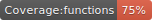
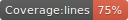

> WIP

    
    
    
    
    

## Tech stack used

- [TypeScript](https://github.com/microsoft/TypeScript/)
- [React-Native](https://github.com/facebook/react-native/)
- [React-Native-Paper](https://github.com/callstack/react-native-paper/)
- [React-Native-Vector-Icons](https://github.com/oblador/react-native-vector-icons/)
- [React-Native-Fast-Image](https://github.com/DylanVann/react-native-fast-image/)
- [React-Native-Teting-Library](https://github.com/callstack/react-native-testing-library/)
- [Redux](https://github.com/reduxjs/redux/)
- [React-Redux](https://github.com/reduxjs/react-redux/)
- [Redux-Observable](https://github.com/redux-observable/redux-observable/)
- [Reselect](https://github.com/reduxjs/reselect/)
- [TypeSafe-Actions](https://github.com/piotrwitek/typesafe-actions/)
- [Detox](https://github.com/wix/Detox/)

## Feedback & Contributing

Feel free to file an issue. Feature requests are welcome, however, they need to be discussed and we cannot guarantee that everything will be implemented. Therefore, preparing a detailed RFC (request for changes) is a good idea. If you wish to contribute, please take a quick look at the CONTRIBUTING.md guide.

## This app is under development so expect changes
